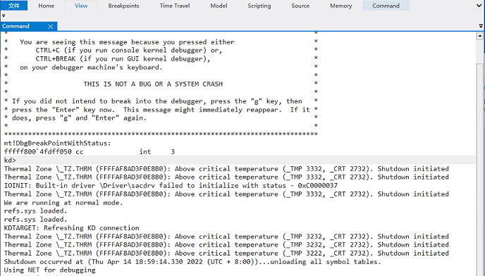
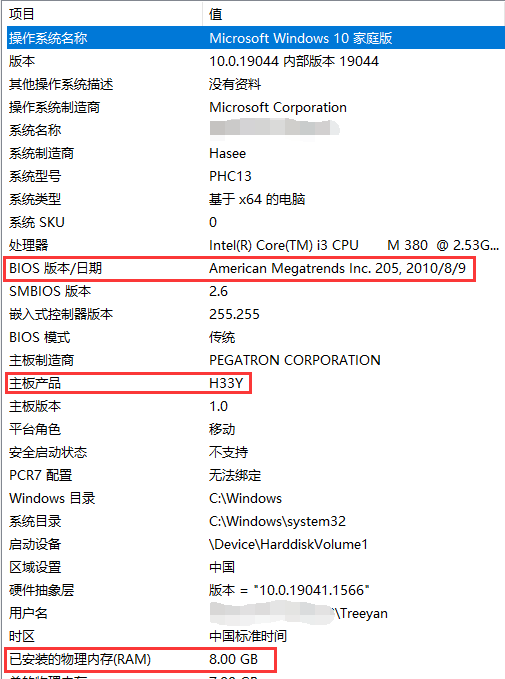

## 修复神舟 A360-I3 D1 HY33 芯片组 intel HM55 不能安装 Windows 10 的问题

***

### 说明
> 因为神舟 A360 BIOS 将系统紧急临界温度由 EC 控制访问，在 Windows8 之前的版本中，总是先调用 EC 的 _REG 模块后才访问 _CRT 所以没有安装运行问题。而 Windows 10 内核会在未调用 _REG 模块的情况下访问 _CRT，BIOS DSDT 只是简单的返回了 0，导致 Windows 10 安装程序紧急关机，无法安装。由于更新 BIOS 有困难，所以有这个小项目。  
>

***

### 功能

> 这是一个简单 MBR 引导程序，启动时修改 DSDT 表并装载第二扇区的引导记录，使 Windows 10 安装程序能正常的读到临界温度。  
> 生成的 h33yfix.bin 文件位置 0x7c00 到 0x7db0 为引导程序，0x1b0 bytes

***

### 使用

>* 备份启动硬盘的 MBR 到第二扇区
>* 将 MBR.BIN 文件覆盖到 MBR 0 到 0xA0 的位置。之后的数据为分区表，id，不要修改，否则可能无法正确引导噢

***

### 注意
> 这台神舟笔记本 BIOS 版本为 205，8G 内存，测试条件有限，无法保证在所有 H33Y 准系统上工作正常。抛砖引玉，以为参考 :)  
>

***

  

2022年4月23日 于重庆
